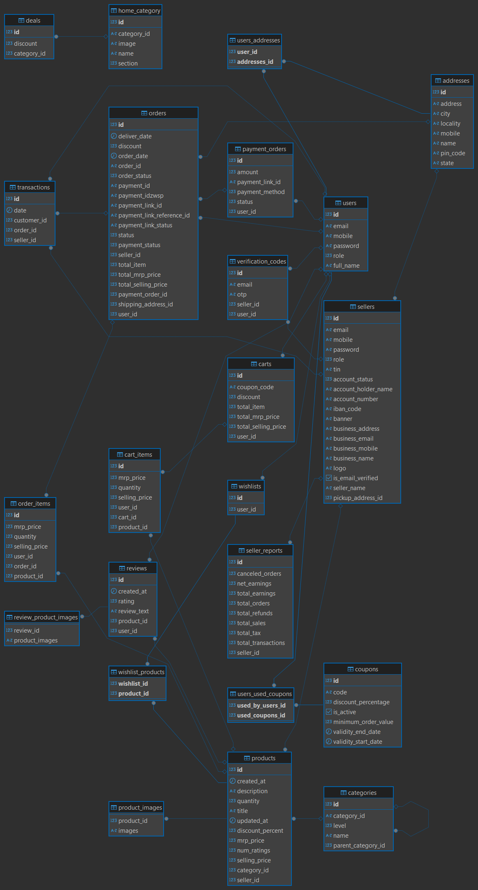

# Electrix - eCommerce Backend 🚀

A **RESTful API** for an eCommerce platform built with **Spring Boot 3**, **Spring Security**, **JWT**, and **PostgreSQL**. Designed for scalability, security, and seamless integration with a React frontend.

---
### ER Diagram
